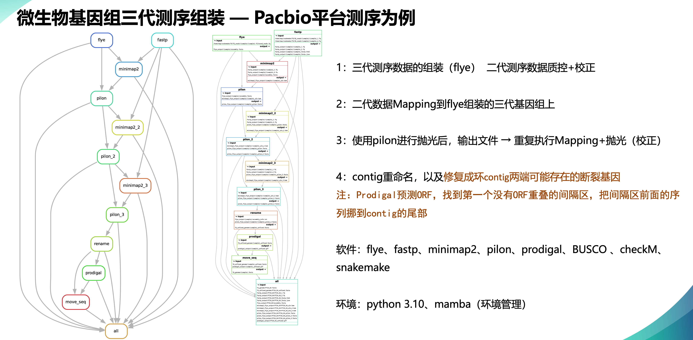

# Third generation sequence assembly

A Snakemake pipeline for third-generation sequence assembly, designed to automate the processing and assembly of third-generation sequencing data through quality control, assembly, polishing, and post-processing.



## Basic Information

| Item        | Details                                                      |
| ----------- | ------------------------------------------------------------ |
| Name        | Third generation sequence assembly                           |
| Date        | 2023-04-24                                                   |
| Description | Snakemake pipeline for automated assembly of third-generation sequencing data, including quality control, de novo assembly, multi-round polishing, and genome optimization. |
| Author      | Tong Xu                                                  |

## Dependencies

The pipeline relies on the following tools (specific versions recommended):

- `fastp = 0.23.2` (short-read quality control)
- `flye = 2.9.2` (third-generation sequence de novo assembly)
- `minimap2 = 2.24` (sequence alignment)
- `samtools = 1.17` (BAM file processing)
- `pilon = 1.24` (genome polishing)
- `prodigal` (ORF prediction for post-processing)

## Directory Structure

### Input Directories

Input data must follow this structure (relative to `base_dir` in the script):

- `SG_reads/{sample}/`: Short-read (second-generation) data, named as `{sample}_1.fq` (R1) and `{sample}_2.fq` (R2).
- `TG_reads/{sample}/`: Third-generation sequencing data, named as `{sample}.filtered_reads.fq`.

### Output Directories

Automatically generated output directories:

- `fastp_output/`: Quality-controlled short reads and fastp reports (JSON/HTML).
- `flye_output/`: Initial assembly results from Flye.
- `minimap2_flye_output/`: Alignment files (BAM) generated by minimap2.
- `pilon_flye_output/`: Polished genomes after each Pilon round.
- `TG_unfixed_genome/`: Renamed contigs before final optimization.
- `prodigal_output/`: ORF prediction results (GFF format) from Prodigal.
- `TG_genome/`: Final optimized genome assemblies.

## Pipeline Workflow

The pipeline runs in the following sequential steps via Snakemake rules:

1. **Quality Control with fastp**
   Trims low-quality bases, adapters, and filters short reads from short-read data. Outputs cleaned reads and quality reports (JSON/HTML).
2. **De novo Assembly with Flye**
   Assembles third-generation reads into initial contigs. Key parameters:
   - Genome size: ~4.5m (optimized for `Phaeobacter gallaeciensis`; adjust based on target species).
   - Coverage limit: 300x (prevents assembly failure due to excessive depth).
3. **Multi-round Genome Polishing**
   - **minimap2**: Aligns cleaned short reads to the assembled genome, generating sorted BAM files.
   - **Pilon (3 rounds)**: Polishes the genome using short-read alignments to correct SNPs and indels, with a minimum depth threshold of 10 for reliable corrections.
4. **Contig Renaming**
   Renames contigs to standardized identifiers (e.g., `{sample}_chromosome_1`, `{sample}_plasmid_1`) based on assembly metrics (length, coverage, circularity from `assembly_info.txt`).
5. **ORF Prediction with Prodigal**
   Predicts open reading frames (ORFs) from renamed contigs to guide genome optimization.
6. **Circular Contig Fixing**
   Adjusts circular contigs to repair potential broken genes by reorienting sequences based on ORF positions (moves non-ORF regions to the end of contigs).

## Usage

1. **Prepare Input Data**: Organize short-read and third-generation data into the required directory structure.

2. **Configure Paths**: Ensure `base_dir` (root directory) and `pilon_jar` (path to Pilon JAR file) in the script are correctly set.

3. **Run the Pipeline:**

   Execute with Snakemake, specifying the number of cores:

   bash

   ```bash
   snakemake --cores [number_of_cores]
   ```

## Notes

- **Genome Size Adjustment**: Modify the `genomeSize` parameter in the Flye rule for non-`Phaeobacter gallaeciensis` species.
- **Polishing Stringency**: Pilon uses `--mindepth 10` to filter low-coverage variants; adjust based on data quality.
- **Circular Contigs**: The final step fixes potential gene breaks in circular contigs, improving genome completeness for downstream analysis.
